# 제24회 한국로봇항공기경연대회 기술개발계획서 초안
## 중급부문

- **소속:** (제출 전 입력)
- **참가팀명:** (제출 전 입력)
- **지도교수:** (제출 전 입력)
- **대표자 외 인원 수:** (제출 전 입력)

---

제24회 한국로봇항공기경연대회 중급부문 1차 예선 기술개발계획서를 아래와 같이 제출한다.

- **제출일:** 2026년 00월 00일
- **대표자명:** (제출 전 입력)
- **지도교수명:** (제출 전 입력)

---

# 목차

1. 전체 시스템의 개요
   1-1. 로봇항공기(드론) 전체 시스템에 대한 설명

2. 자동비행 시스템 및 구현 기술
   2-1. 유도, 제어, 항법시스템 설계
   2-2. 임무 장치 및 수행 방법
   2-3. 구성품의 적정성
   2-4. 지상 및 비행 시험 계획

3. 시스템 설계 및 제작상의 특장점
   3-1. 시스템 구현에서의 창의성

4. 안전장치에 대한 설명
   4-1. 안전장치의 구성 및 성능
   4-2. 안전장치의 기술적 적정성
   4-3. 안전장치의 시뮬레이션 또는 실제 작동

부록. 그림 구성 계획

---

# 작성 방향 요약

본 계획서의 핵심은 기체 자체 제작보다 **GPS 비의존 자율비행 소프트웨어**에 있다. 대회 규정은 실내 환경, GPS 사용 금지, 2m 고도 유지, 격자 구획선 기반 이동, ArUco 경로점 탐색, 구조 경로 재방문을 요구한다. 이에 본 팀은 하향 카메라, IMU, ToF 거리 센서를 이용한 Optical Flow 기반 항법과 ROS2/PX4 Offboard 제어 소프트웨어로 승부한다.

전략은 두 단계로 나뉜다. 탐색 단계에서는 격자 교차점만을 목표로 S자 경로를 고속 주파하며, 전통적인 라인 PID 없이 Optical Flow 위치 제어와 교차점 스냅으로 격자선 근처를 비행한다. 마커 4개를 찾은 직후에는 격자를 완전히 무시하고 저장된 마커 좌표 사이를 직선 스프린트로 이동한다. 즉, 구획선 이탈 점수는 자연스럽게 부분 획득하고, 개발 자원은 위치 추정 정확도, 고속 통과 인식, 스프린트 속도 튜닝에 집중한다.

---

# 1. 전체 시스템의 개요

## 1-1. 로봇항공기(드론) 전체 시스템에 대한 설명

### 시스템 개요

- **기체 종류:** PX4 또는 ArduPilot Offboard 제어가 가능한 멀티콥터형 드론
- **비행 방식:** GPS 비의존 실내 자율비행, 하향 비전 기반 위치 추정, PX4 Offboard 속도/위치 setpoint 제어
- **주요 임무:** 24m x 15m 격자 미션 구역에서 ArUco 경로점 4개 탐색, ID 역순 구조 경로 재방문, 버티포트 복귀 및 자동 착륙
- **운용 환경:** 32m x 23m 안전구역, 3m 간격 격자, 2m 규정 고도, GPS 사용 금지
- **핵심 개발 방향:** 하드웨어는 검증된 비행 플랫폼을 사용하고, 경쟁력은 비전 항법, 경로 계획, 미션 상태 머신, Offboard 제어 소프트웨어에서 확보

### 시스템 설계 철학

본 시스템은 일반적인 라인 트레이싱 드론이 아니라, 격자 환경을 **위치 보정 가능한 스프린트 주행장**으로 해석한다. 탐색 단계에서는 교차점-to-교차점 경로 자체가 격자선 위를 지나가므로 전통적인 라인 PID를 별도로 구현하지 않는다. 대신 교차점 검출 시 위치를 격자 좌표로 강제 정렬하여 Optical Flow 누적 오차를 리셋한다.

마커 4개가 모두 발견되면 더 이상 격자 경로를 따르지 않는다. 규정상 구조 경로는 구획선 추종 기능을 검증하지 않으므로, 저장된 마커 좌표 사이를 유클리드 최단 직선으로 스프린트한다. 이 단계에서 임무 시간 점수의 차이를 만든다.

### 비행 단계

| 단계 | 목적 | 핵심 소프트웨어 |
|------|------|----------------|
| Phase 0 | 이륙, 2m 고도 도달, Home Pose 초기화 | PX4 Offboard, Home/Grid 좌표 변환 |
| Phase 1 | 격자 교차점 고속 탐색, ArUco 4개 발견 | Optical Flow, 교차점 스냅, 통과 중 ArUco 인식 |
| Phase 2 | 저장 마커 좌표 ID 역순 재방문 | Direct Sprint Planner, 비전 서보 재정렬 |
| Phase 3 | 버티포트 복귀 및 착륙 | Home Pose 귀환, Vertiport Detector, Vision Servo Landing |

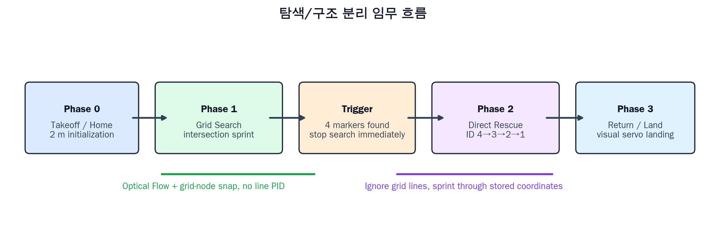

**Fig. 2.** 탐색과 구조를 분리한 전체 미션 상태 흐름. Phase 1은 격자 교차점 기반 탐색으로 구획선 이탈 점수를 부분 확보하고, 4개 마커 발견 즉시 Phase 2 직선 구조 스프린트로 전환한다.

### 전체 시스템 구성도

```text
[지상국/C2]
    |
    | mission start / abort / monitor
    v
[Companion Computer: ROS2 C++ Nodes]
    |
    |  perception + localization + planning + setpoint
    v
[PX4 Flight Controller] ---- [ESC/Motor]
    ^
    |
    +-- [IMU / Barometer / ToF]
    |
    +-- [Downward Global Shutter Camera]
            |
            +-- Optical Flow
            +-- Grid Intersection Detector
            +-- ArUco Detector
            +-- Vertiport Detector
```

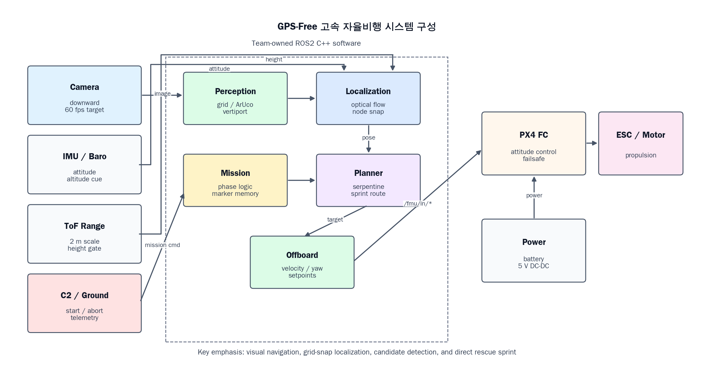

**Fig. 1.** GPS 비의존 자율비행 소프트웨어 중심의 전체 시스템 구성. 하향 카메라와 거리/자세 센서 입력을 ROS2 C++ 노드가 처리하고, PX4 Offboard setpoint로 비행제어기에 전달한다.

### 주요 하드웨어 구성

| 구성품 | 후보/요구사항 | 역할 |
|--------|---------------|------|
| 비행제어기 | PX4 또는 ArduPilot 지원 FC | 자세 제어, 고도 제어, Offboard setpoint 수행 |
| Companion Computer | Raspberry Pi 4/5 또는 Jetson Orin Nano급 | ROS2 비전/항법/계획/미션 소프트웨어 실행 |
| 하향 카메라 | 글로벌 셔터, 60fps 이상, 90~120도 화각 | Optical Flow, 격자 교차점 검출, ArUco/버티포트 인식 |
| ToF 거리 센서 | 2m 부근 안정 측정 | 규정 고도 유지, Optical Flow 스케일 보정 |
| 통신 모듈 | C2 및 모니터링 | 미션 시작/중지, 상태 모니터링 |
| 배터리/전원 | 급가속 시 전압 강하 방지 | 비행 전원 및 Companion Computer 안정 전원 공급 |

---

# 2. 자동비행 시스템 및 구현 기술

## 2-1. 유도, 제어, 항법시스템 설계

### 항법 시스템 개요

본 시스템은 GPS를 사용하지 않고 하향 카메라 기반 Optical Flow와 IMU, ToF를 융합해 위치를 추정한다. Optical Flow는 프레임 간 지면 픽셀 이동량을 계산하고, ToF로 측정한 고도를 이용해 픽셀 이동량을 실제 거리로 환산한다. IMU는 자세와 단기 움직임을 예측하며, 교차점 또는 ArUco가 인식될 때마다 절대 기준으로 위치를 보정한다.

```text
IMU 예측
   +
Optical Flow 이동량
   +
ToF 고도 스케일
   |
   v
[Visual-Inertial Estimator]
   |
   +-- 교차점 검출 시: Grid node snap
   +-- ArUco 검출 시: marker ID + coordinate save
   +-- Home Pose 변환: Grid <-> Home
```

### 교차점 스냅 기반 위치 보정

Optical Flow는 적분 방식이므로 장거리 이동 시 drift가 누적된다. 본 시스템은 3m 간격의 격자 교차점을 위치 보정 기준으로 사용한다. 드론이 교차점을 통과할 때 현재 위치를 가장 가까운 격자 노드 좌표로 강제 정렬하고, 이후 Optical Flow 적분을 다시 시작한다.

```text
교차점 인식
-> estimated_position = grid_node_coordinate
-> drift reset
-> 다음 교차점까지 Optical Flow 적분 재개
```

이 방식은 라인 위를 계속 정밀 추종하는 것보다 단순하고 빠르며, 대회 미션에서 중요한 경로점 위치 추정 정확도와 임무 시간 점수에 직접 기여한다.

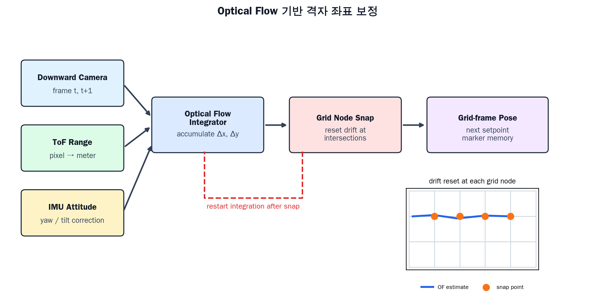

**Fig. 3.** 하향 카메라 Optical Flow, ToF 고도 스케일, IMU 자세 보정을 통합하고, 교차점 통과 시 grid node snap으로 누적 오차를 리셋하는 항법 구조.

### 제어 구조

| 계층 | 구현 내용 |
|------|-----------|
| 비행 안정화 | PX4 Flight Controller의 자세/고도 제어 사용 |
| 고수준 제어 | ROS2 `px4_offboard_control_node`가 20Hz 이상 setpoint 송신 |
| 속도 계획 | `sprint_planner_node`가 가속/감속 기반 속도 프로파일 생성 |
| 인식 연동 제어 | 흔들림, 마커 후보, 버티포트 중심 오차에 따라 SPRINT/APPROACH/ANTI_SWAY/VISION_SERVO 모드 전환 |
| 안전 제어 | 저전압, 통신 이상, 위치 drift 과다, 마커 재검출 실패 시 감속 또는 귀환 |

### 소프트웨어 구조

실시간성이 요구되는 주요 노드는 C++ 기반 ROS2 노드로 구현한다. Python은 로그 분석, 시각화, 파라미터 스윕 등 비실시간 도구에 한정한다.

```text
/drone/camera/down/image_raw
        |
        +--> grid_detector_node --------> /grid/intersections
        +--> aruco_tracker_node --------> /markers/confirmed
        +--> visual_odometry_node ------> /localization/pose_grid
        |
/fmu/out/* -----------------------------> visual_odometry_node
                                            |
                                            v
                                  sprint_planner_node
                                            |
                                            v
                                  mission_manager_node
                                            |
                                            v
                                  px4_offboard_control_node
                                            |
                                            v
                                  /fmu/in/trajectory_setpoint
```

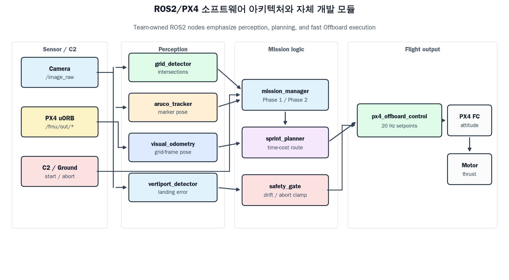

**Fig. 4.** 자체 개발 ROS2 C++ 노드와 PX4 Offboard 제어 계층의 연결 구조. 실시간 비행 노드는 C++로 구성하고, 로그 분석과 파라미터 sweep은 Python 도구로 분리한다.

### 구현 중인 주요 패키지

| 패키지 | 역할 |
|--------|------|
| `grid_detector` | 격자선 방향 분류, 선분 병합, 교차점 추출, 신뢰도 계산 |
| `aruco_tracker` | ArUco 검출 결과 누적, 흔들림 기반 Confidence Filter, 후보/확정/방문 상태 관리 |
| `visual_odometry` | Optical Flow 속도 변환, yaw-aware pose integration, grid snap, Home/Grid SE2 변환 |
| `sprint_planner` | 직선 구간 시간 비용, 회전/정지/호버링/안정화 비용 기반 경로 평가 |
| `mission_manager` | 미션 단계 상태 머신, 마커 저장, ID 역순 구조 경로 생성, 저전압 귀환 |
| `px4_offboard_control` | 제어 모드 매핑, 속도 제한, 가속도 rate limiting, 비전 서보 clamp |
| `vertiport_detector` | 착륙 대상 검출, 중심 오차 기반 하강 조건 판단 |
| `sprint_drone` | Gazebo/PX4/ROS2 통합 launch, world, bridge, params 관리 |

## 2-2. 임무 장치 및 수행 방법

### 임무 시나리오

1. C2 명령으로 자동 이륙 후 2m 고도에 도달한다.
2. Home Pose를 저장하고 미션 구역 첫 교차점에서 Grid 좌표계를 확정한다.
3. Phase 1에서 54개 교차점을 S자 패턴으로 고속 주파하며 ArUco 4개를 통과 중 인식한다.
4. 마커 4개가 발견되는 즉시 남은 탐색을 중단하고 Phase 2로 전환한다.
5. 저장된 마커 좌표를 ID 내림차순으로 정렬하고, 좌표 간 직선 스프린트를 수행한다.
6. 각 구조 마커 접근 시 ArUco를 재검출하고 비전 서보로 중심을 정렬한 뒤 3초 호버링한다.
7. 마지막 마커 방문 후 Home Pose로 직선 귀환하고, 버티포트를 하향 카메라로 재획득해 자동 착륙한다.

### Phase 1: 교차점-to-교차점 탐색

탐색 경로는 3m 격자 교차점을 따라 S자 패턴으로 구성한다. 각 교차점은 정지점이 아니라 위치 보정 체크포인트다. 드론은 교차점을 통과하며 Optical Flow drift를 리셋하고, 동시에 ArUco 검출을 수행한다.

| 항목 | 설계 |
|------|------|
| 목표 경로 | 9 x 6 = 54개 교차점 S자 주파 |
| 라인 제어 | 별도 라인 PID 미구현, 교차점 좌표 기반 이동 |
| 위치 보정 | 교차점 검출 시 grid node snap |
| 마커 인식 | 정지 없이 통과 중 N프레임 누적 검출 |
| 속도 목표 | 초기 4~6m/s, 튜닝 6~8m/s |

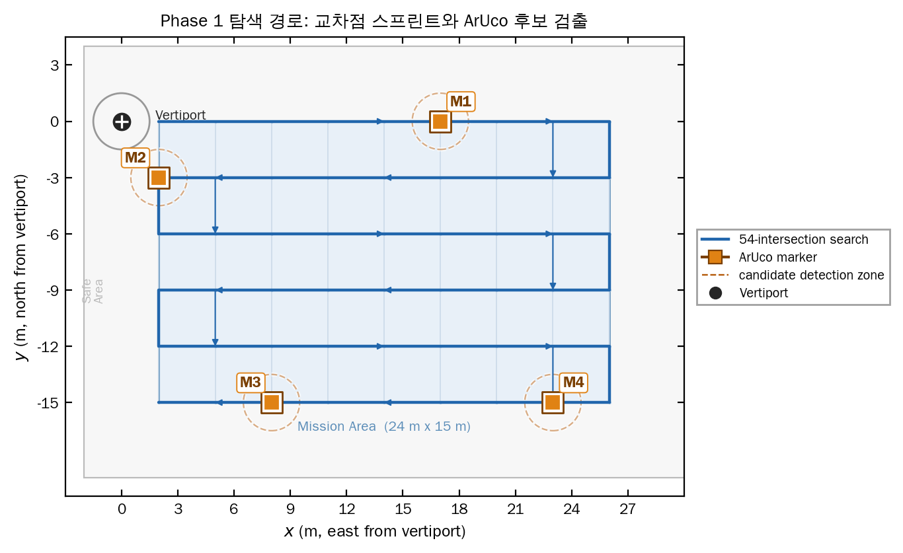

**Fig. 5.** 현재 마커 배치를 반영한 Phase 1 교차점-to-교차점 S자 탐색 경로. 경로 자체가 격자선 근처를 지나가므로 별도 라인 PID 없이도 구획선 이탈 점수를 부분 확보하고, ArUco 마커는 정지 없이 통과 중 인식한다.

단, 대회 공식 질의 결과 탐색 최초 인식 시 3초 호버링이 필수로 확정될 경우에는 `FIRST_DETECT_HOVER` 모드를 활성화한다. 이 경우에도 기본 탐색 로직은 통과 중 인식으로 유지하고, 확정 마커에서만 감속/정렬/호버링을 수행한다.

### Phase 2: 구조 경로 자유 스프린트

구조 경로는 구획선 추종 기능을 검증하지 않는 구간이므로 격자선을 무시한다. 저장된 마커 좌표 사이를 유클리드 최단 직선으로 연결하고, 각 구간에 대해 가속-순항-감속 속도 프로파일을 생성한다.

| 항목 | 설계 |
|------|------|
| 방문 순서 | ArUco ID 내림차순 |
| 경로 | 저장 좌표 간 직선 |
| 속도 목표 | 초기 6~8m/s, 튜닝 8~12m/s |
| 정확도 확보 | 저장 좌표 2m 이내 진입 후 ArUco 재검출 및 비전 서보 |
| 채점 대응 | 방문 순서 40점, 통과 위치 정확도 80점 확보 목표 |

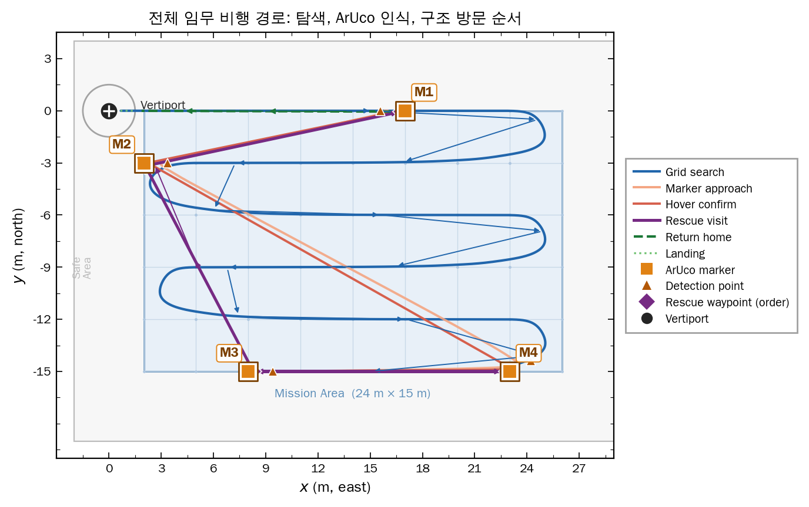

**Fig. 6.** `mission_path_real` 생성 방식과 동일한 경로 시각화 스타일로 작성한 전체 미션 시퀀스. 탐색, 마커 접근, 3초 호버 확인, ID 역순 구조 방문, 귀환 및 착륙 접근을 색상과 이벤트 마커로 분리해 표현한다.

### Phase 3: 귀환 및 착륙

귀환은 마지막 마커 위치에서 Home Pose 예측 위치까지 직선 스프린트로 수행한다. 버티포트 근처에서는 속도를 낮추고 하향 카메라로 원형 외곽 또는 착륙 마커를 검출한다. 최종 하강은 중심 오차, 수평 속도, 고도 안정 조건을 만족할 때만 진행한다.

### 예상 임무 시간

시간 계산에서 줄일 수 없는 고정 시간은 탐색 마커 확인 호버링 12초와 구조 마커 확인 호버링 12초, 총 24초다. 따라서 시간 점수의 핵심 변수는 Phase 1에서 마지막 마커를 얼마나 빨리 찾는지와 Phase 2 직선 스프린트에서 감속/재가속 손실을 얼마나 줄이는지다.

| 시나리오 | Phase 0 이륙/초기화 | Phase 1 탐색 | Phase 2 구조 스프린트 | Phase 3 귀환/착륙 | 합계 |
|----------|---------------------|--------------|-----------------------|-------------------|------|
| 최선 | 4초 | 34초 | 22초 | 5초 | 65초 |
| 평균 | 4초 | 48초 | 23초 | 5초 | 80초 |
| 최악 | 4초 | 54초 | 24초 | 5초 | 87초 |

위 계산은 탐색 5m/s, 구조/귀환 8m/s, 탐색 감속/재가속 오버헤드 10초, 구조 감속/재가속 오버헤드 6초를 포함한 보수 모델이다. 동일 가정을 적용해 600개 랜덤 ArUco 배치를 sweep한 결과 총 임무 시간은 최소 63.3초, 중앙값 82.6초, 최대 93.1초로 계산되었다. 60초 근처 기록은 마커가 앞쪽에 몰리는 배치와 탐색/구조 속도 튜닝이 동시에 맞아야 가능하므로, 본 계획의 개발 우선순위는 Optical Flow 정확도 유지 범위 안에서 탐색 속도를 6~8m/s까지 끌어올리고 Phase 2 감속 손실을 줄이는 데 둔다.

Phase 1 탐색 속도만 5/6/7m/s로 바꾸어 동일한 600개 랜덤 배치를 다시 계산하면, 총 임무 시간 중앙값은 각각 82.6초, 77.8초, 74.5초로 감소한다. 70초 이하 배치는 27개, 73개, 122개로 증가하지만, 60fps 기준 마커 가시 프레임 수는 36.0프레임, 30.0프레임, 25.7프레임으로 줄어든다. 따라서 7m/s 이상 탐색은 시간상 유리하지만 실제 한계는 속도별 ArUco 인식 성공률 실험으로 결정한다.

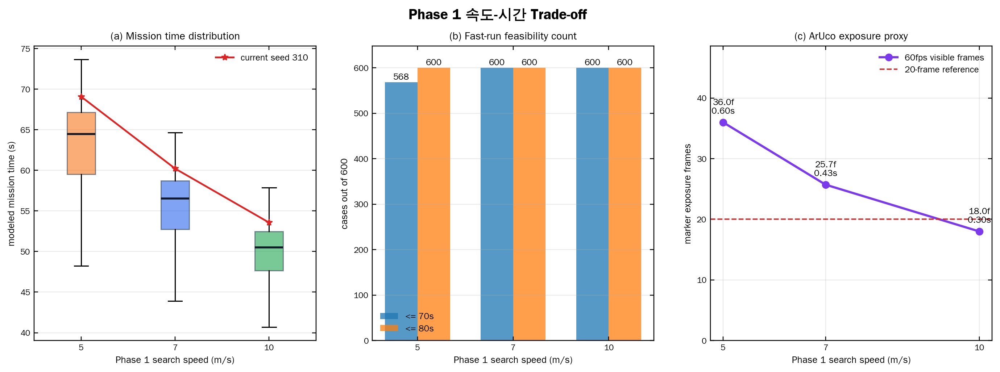

**Fig. 13.** Phase 1 탐색 속도를 5/6/7m/s로 바꾼 mission-cost sweep 결과. 임무 시간 분포, 70초/80초 이하 배치 수, 60fps 기준 ArUco 마커 노출 프레임 수를 함께 비교한다.

### 사용 센서 및 장비

| 장비 | 목적 |
|------|------|
| 하향 글로벌 셔터 카메라 | Optical Flow, 격자 교차점, ArUco, 버티포트 검출 |
| IMU | 자세 추정, 흔들림 프레임 제외, 단기 움직임 예측 |
| ToF 거리 센서 | 2m 고도 유지, Optical Flow 스케일 보정 |
| 기압계 | 고도 보조 |
| 통신 모듈 | C2 명령, 상태 모니터링, 비상 개입 |

## 2-3. 구성품의 적정성

본 팀의 구성품 선정 기준은 "고속 자율비행 소프트웨어가 요구하는 센서 품질과 제어 인터페이스를 제공하는가"이다. 기체 자체의 독창성보다, 실시간 제어 가능한 FC와 하향 비전 처리 가능한 온보드 컴퓨팅 환경을 우선한다.

| 구성품 | 선정 이유 |
|--------|-----------|
| PX4/ArduPilot 지원 비행제어기 | Offboard/Guided 제어를 통해 ROS2에서 속도, 위치, yaw setpoint를 실시간 전달 가능 |
| 글로벌 셔터 하향 카메라 | 고속 이동 중 rolling shutter 왜곡을 줄여 Optical Flow와 ArUco 인식률 확보 |
| Companion Computer | C++ ROS2 노드 기반 비전/항법/계획/제어 실행 |
| ToF 거리 센서 | 2m 고도 유지와 Optical Flow pixel-to-meter scale 보정 |
| 독립 5V DC-DC 전원 | 급가속 시 Companion Computer 리셋 방지 |
| 경량 통신 모듈 | 미션 시작/중지 및 안전 모니터링 |

### 구성품별 기술적 적합성

**비행제어기(PX4/ArduPilot 지원 FC)**는 검증된 자세 안정화와 failsafe 기능을 제공하면서도 외부 Companion Computer에서 속도, 위치, yaw setpoint를 주기적으로 입력할 수 있어야 한다. 본 미션의 핵심 제어는 ROS2 노드가 생성하는 Offboard setpoint에 있으므로, FC는 저수준 자세 안정화와 안전장치 계층을 담당하고 고수준 임무 판단은 Companion Computer에서 수행하는 구조가 적합하다.

**글로벌 셔터 하향 카메라**는 본 시스템에서 가장 중요한 임무 센서다. Optical Flow는 프레임 간 픽셀 이동량을 적분해 위치를 추정하므로, 고속 이동 중 rolling shutter 왜곡이 발생하면 이동량 추정과 교차점 검출이 동시에 흔들린다. 또한 50cm ArUco 마커를 통과 중 여러 프레임에서 인식해야 하므로, 60fps 이상과 90~120도 화각을 확보하면 2m 고도에서 마커가 시야에 머무는 시간을 늘릴 수 있다.

**ToF 거리 센서**는 단순 고도 유지용 보조 센서가 아니라 Optical Flow 스케일 보정의 기준이다. 동일한 픽셀 이동량이라도 실제 이동 거리는 고도에 비례하므로, 2m 규정 고도 부근의 실시간 거리 측정이 정확해야 pixel-to-meter 환산 오차가 줄어든다. 고도 유지 점수뿐 아니라 위치 추정 정확도와 구조 재방문 정확도에도 직접 영향을 준다.

**Companion Computer**는 하향 영상 처리, Optical Flow, ArUco 누적 검출, 경로 계획, 미션 상태 전환을 동시에 실행해야 한다. 따라서 단순 원격 명령 처리용 보드가 아니라 OpenCV와 ROS2 C++ 노드를 안정적으로 실행할 수 있는 연산 여유가 필요하다. Python은 로그 분석과 파라미터 스윕에 한정하고, 실시간 노드는 C++로 구성해 프레임 처리 지연과 setpoint 지연을 줄인다.

**독립 전원 모듈**은 고속 스프린트 전략에서 필수다. 급가속/급감속 시 모터 부하 변화로 주전원 전압이 흔들릴 수 있으며, 이때 Companion Computer가 리셋되면 Offboard setpoint가 끊겨 failsafe로 이어진다. 비행 전원과 컴퓨팅 전원을 분리해 소프트웨어 안정성을 보장한다.

## 2-4. 지상 및 비행 시험 계획

### 개발 및 시험 환경

- **OS/미들웨어:** Ubuntu 24.04, ROS2 Jazzy
- **시뮬레이터:** Gazebo Harmonic
- **비행제어:** PX4 SITL, Micro XRCE-DDS Agent, ROS2-PX4 bridge
- **구현 언어:** 실시간 노드는 C++17, 분석/시각화 도구는 Python
- **월드 모델:** 32m x 23m 안전구역, 24m x 15m 미션 구역, 3m 격자, ArUco 마커, 버티포트 포함

### 현재 구현 및 검증 현황

현재 C++ 핵심 패키지와 ROS2 노드 scaffold는 구축되어 있으며, PX4 SITL과 Gazebo 월드 연동이 진행되어 있다. 보고서의 경로 그림은 현재 마커 배치와 미션 상태 흐름을 반영해 생성하고, 안전장치 검증 그림은 기존 Gazebo 경기장 월드와 ROS2 통합 launch 스택을 실행해 기록한 rosbag 데이터에서 생성한다. 최근 로컬 검증 기준으로 PX4 SITL 빌드, Micro XRCE-DDS Agent 실행, 하향 카메라 이미지 토픽, 자세/센서 토픽, Mission start를 통한 PX4 Offboard 진입이 확인되었다.

| 구분 | 완료/진행 내용 |
|------|----------------|
| Core algorithm | `sprint_planner`, `grid_detector`, `aruco_tracker`, `visual_odometry`, `mission_manager`, `px4_offboard_control` 단위 구현 |
| ROS2 nodes | perception, planner, mission, offboard control 노드 scaffold |
| Simulation world | 경기장 격자, 버티포트, ArUco 마커 배치 월드 및 이동 카메라 rig |
| PX4 SITL | `gz_x500_mono_cam_down` 기반 하향 카메라 모델 실행 |
| Smoke check | `/mission/start` 후 Offboard/armed 상태 진입 확인 |

### 랜덤 ArUco 배치 sweep

마커가 서로 뭉쳐 있거나 멀리 떨어진 배치에서도 전략이 유지되는지 확인하기 위해, Gazebo 월드와 동일한 54개 격자 교차점 후보에서 seed 0~599의 랜덤 배치를 생성하고 mission-cost 모델로 탐색 종료 시점, 구조 스프린트 거리, 총 임무 시간을 계산했다. 이 sweep은 전체 Gazebo 물리 시뮬레이션을 매번 다시 실행한 것이 아니라, 실제 월드 좌표계와 동일한 교차점 후보, 동일한 S자 탐색 순서, ID 역순 구조 규칙을 사용한 경로 비용 기반 반복 테스트다.

현재 보고서 figure에 반영한 Gazebo seed 310은 spread 유형으로, 최소 마커 간 거리는 13.4m, 4개 마커 발견 시점은 52/54번째 교차점이다. 탐색 5m/s, 구조/귀환 8m/s, 탐색 호버 12초, 구조 호버 12초, 감속/재가속 오버헤드를 포함한 보수 모델에서 seed 310의 총 임무 시간은 87.5초로 계산되었다. 중앙값 기준 총 임무 시간은 clustered 80.8초, mixed 83.5초, spread 85.3초였으며, 마커가 멀리 떨어질수록 구조/귀환 거리가 증가하지만 Phase 2 직선 스프린트로 증가분을 제한할 수 있음을 확인했다.

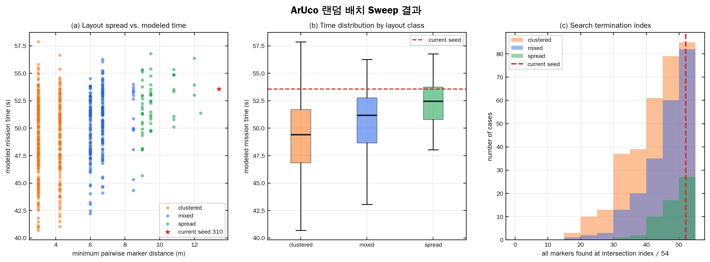

**Fig. 11.** 600개 랜덤 ArUco 배치에 대한 교차점 기반 mission-cost sweep 결과. 군집/혼합/분산 배치별 총 임무 시간과 4개 마커 발견 시점을 비교하고, 현재 Gazebo seed 310 배치를 별도로 표시했다.

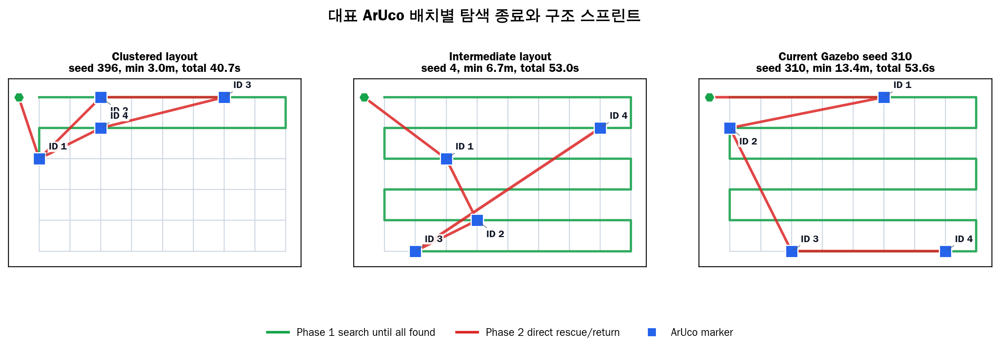

**Fig. 12.** 군집 배치, 중간 배치, 현재 Gazebo seed 310 분산 배치의 대표 경로 비교. Phase 1은 4개 마커가 모두 발견되는 지점까지만 수행하고, 이후 Phase 2는 ID 역순 직선 구조/귀환 경로로 전환한다.

### 지상 시험

| 시험 항목 | 목표 |
|-----------|------|
| 하향 카메라 영상 수신 | 25~60fps 범위에서 프레임 드롭 여부 확인 |
| 격자선/교차점 검출 | 2m 고도 시뮬레이션 영상에서 교차점 검출 신뢰도 확보 |
| ArUco 통과 인식 | 4/6/8m/s 영상 조건에서 ID 누적 검출 성공률 측정 |
| Optical Flow 스케일 | 2m 고도에서 pixel-to-meter scale 오차 측정 |
| PX4 Offboard setpoint | 20Hz 이상 안정 송신 및 failsafe 미발생 확인 |
| 전원 안정성 | 급가속 부하에서 Companion Computer 전압 강하 확인 |

### 비행 및 시뮬레이션 시험

| 단계 | 시험 | 성공 기준 |
|------|------|-----------|
| T01 | 2m 이륙/호버링 | 고도 오차 ±0.3m 이내 |
| T02 | 단일 격자 edge 3m 직진 | 횡방향 오차 ±0.3m 이내 |
| T03 | 교차점 통과/스냅 | 스냅 후 위치 오차 0.5m 이내 |
| T04 | 통과 중 ArUco 인식 | 정지 없이 ID 저장 성공 |
| T05 | Phase 1 전체 탐색 | 4개 마커 발견 및 저장 |
| T06 | Phase 2 구조 스프린트 | ID 역순 방문, 각 마커 3초 호버링 |
| T07 | 귀환/착륙 | 버티포트 중심 오차 0.3~0.5m 이내 |
| T08 | 랜덤 마커 배치 반복 | 600개 배치 mission-cost sweep 및 대표 배치 Gazebo 재검증 |
| T09 | 전체 미션 통합 | 이륙부터 착륙까지 연속 완주 |

### 일정 계획

| 단계 | 개발 목표 | 완료 기준 |
|------|-----------|-----------|
| 1단계 | Optical Flow + 교차점 스냅 검증 | 단일 edge 및 교차점 snap 오차 측정 |
| 2단계 | 고속 통과 ArUco 인식 검증 | 4/6/8m/s 조건별 성공률 확보 |
| 3단계 | PX4 Offboard 제어 튜닝 | 2m 고도, 속도 제한, jerk 제한 안정화 |
| 4단계 | Phase 1 탐색 통합 | 54교차점 탐색 및 4마커 저장 |
| 5단계 | Phase 2 구조 스프린트 통합 | ID 역순 직선 스프린트 및 비전 재정렬 |
| 6단계 | 귀환/착륙 통합 | Home Pose 귀환 및 버티포트 비전 서보 착륙 |
| 7단계 | 반복 실험/파라미터 스윕 | 전체 임무 시간, 마커 배치 민감도, 성공률 최적화 |

---

# 3. 시스템 설계 및 제작상의 특장점

## 3-1. 시스템 구현에서의 창의성

### 차별화 요소

1. **교차점-to-교차점 Optical Flow 항법**

   격자선을 연속적으로 따라가는 라인 PID 방식 대신, 3m 간격 교차점을 위치 보정 기준으로 사용한다. 이 방식은 구현 복잡도를 줄이면서도 경로점 위치 정확도와 탐색 속도를 동시에 확보한다.

2. **탐색과 구조의 명확한 전략 분리**

   탐색 단계에서는 격자 근처를 비행해 구획선 이탈 점수를 일부 확보하고, 마커 4개 발견 직후부터는 격자를 완전히 무시한다. 구조 단계는 저장 좌표 간 직선 스프린트로 시간 점수를 노린다.

3. **고속 통과 ArUco 인식**

   마커 발견을 위해 매 교차점에서 정지하지 않는다. 하향 카메라의 시야 폭, FPS, 마커 크기를 활용해 통과 중 여러 프레임을 누적하고, Confidence Filter로 ID를 확정한다.

4. **물리 기반 Sprint Planner**

   경로 거리가 아니라 실제 비행 시간을 비용으로 계산한다. 직선 구간의 가속/감속, 회전 손실, 안정화 시간, 호버링 시간, 마커 후보 검출 상태를 반영해 최소 시간 경로를 선택한다.

5. **Perception-Aware Offboard Control**

   비전 인식 상태와 기체 흔들림 상태에 따라 SPRINT, APPROACH, ANTI_SWAY, VISION_SERVO 모드를 전환한다. 속도를 높이는 동시에 인식 실패와 제동 실패를 줄이는 제어 구조다.

6. **PX4 SITL 기반 반복 검증**

   실제 비행 전 Gazebo/PX4/ROS2 통합 환경에서 월드, 센서, 미션 상태 머신, Offboard 제어를 반복 검증한다. Python 도구는 로그 분석과 파라미터 스윕에 사용하여 개발 속도를 높인다.

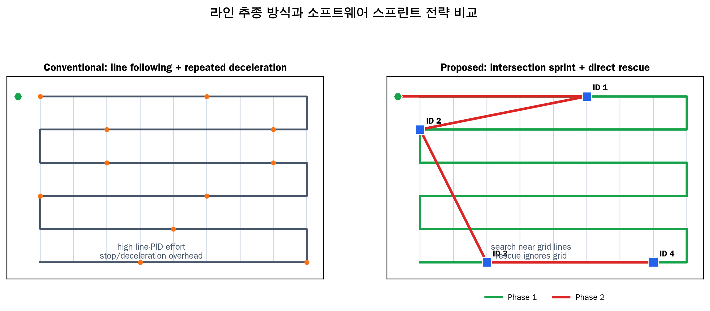

**Fig. 9.** 일반적인 라인 추종 중심 접근과 본 팀의 교차점 스프린트/직선 구조 전략 비교. 라인 PID에 개발 시간을 집중하는 대신, Optical Flow 위치 정확도와 구조 스프린트 속도 튜닝에 자원을 배분한다.

### 점수 전략

| 채점 항목 | 배점 | 목표 | 대응 기술 |
|-----------|------|------|-----------|
| 경로점 위치 추정 | 120점 | 상 등급 | 교차점 스냅, Grid 좌표 저장 |
| ArUco ID 식별 | 40점 | 전량 확보 | 통과 중 누적 검출, Confidence Filter |
| 고도 유지 | 30점 | 상 등급 | ToF + PX4 고도 튜닝 |
| 구획선 이탈 | 40점 | 부분 획득 | 교차점 직선 경로로 격자선 근처 비행 |
| 구조 방문 순서 | 40점 | 전량 확보 | ID 내림차순 정렬 |
| 구조 통과 정확도 | 80점 | 상 등급 | ArUco 재검출, 비전 서보 중심 정렬 |
| 임무 수행 시간 | 100점 | 최상위권 | Phase 1 무정지 탐색, Phase 2 직선 스프린트 |
| 자체 개발 가산 | 50점 | 최대 확보 | Optical Flow, Planner, Mission Manager, Control SW 자체 개발 |

### 기대 효과

- 전통적인 라인 PID 개발에 들어갈 시간을 위치 추정 정확도와 스프린트 속도 튜닝에 집중할 수 있다.
- 구조 단계에서 격자 경로 대비 이동 거리를 크게 줄일 수 있다.
- 반복 가능한 SITL 실험으로 속도, 인식률, 안전 한계를 데이터 기반으로 조정할 수 있다.
- 심사 관점에서 자체 개발 소프트웨어의 역할이 명확하다.

---

# 4. 안전장치에 대한 설명

## 4-1. 안전장치의 구성 및 성능

| 안전 기능 | 설명 |
|-----------|------|
| C2 Mission Abort | 지상국에서 즉시 미션 중단 및 감속/호버/착륙 명령 |
| PX4 Failsafe | Offboard setpoint 단절, 통신 이상, 센서 이상 시 PX4 failsafe 사용 |
| 저전압 감지 | Mission Manager가 low battery 상태를 감지하면 즉시 귀환 모드 전환 |
| 속도/가속도 envelope | 모드별 `v_max`, `a_max`, jerk 제한으로 과도한 자세 변화 방지 |
| Drift 감시 | 위치 drift metric이 임계값을 넘으면 속도 제한 및 최근 교차점 재획득 |
| 마커 재검출 실패 대응 | 저장 좌표 주변 소형 탐색 패턴 수행 |
| 버티포트 재검출 실패 대응 | Home Pose 주변 제한 반경 탐색 후 착륙 조건 재평가 |
| 착륙 조건 gate | 중심 오차, 수평 속도, 고도 안정 조건 충족 시에만 하강 |

## 4-2. 안전장치의 기술적 적정성

### 안전 설계 내용

1. **속도 우선 전략의 제약 조건 명시**

   본 시스템은 빠른 스프린트를 목표로 하지만, 제동 거리와 마커 재검출 가능 거리를 항상 먼저 계산한다. Phase 2 접근 반경은 `max(2m, 필요 제동 거리 + 인식 안정 거리)`로 설정하여 고속 비행이 위치 정확도 점수를 해치지 않도록 한다.

2. **비전 인식 실패 시 감속 우선**

   ArUco, 교차점, 버티포트 검출 신뢰도가 낮아지면 즉시 속도 제한을 낮추고, 최근에 신뢰 가능한 위치 기준으로 재획득한다.

3. **PX4 기본 안정화 기능 활용**

   자세 안정화, 모터 출력 제한, failsafe는 검증된 PX4 계층을 사용하고, 본 팀은 그 위에서 mission-level setpoint와 안전 gate를 구현한다.

4. **실제 비행 전 SITL 반복 검증**

   속도, 가속도, jerk, 인식률 파라미터를 Gazebo/PX4 SITL에서 먼저 검증한 뒤 실제 기체 시험으로 이동한다.

### 비상 대응 절차

| 상황 | 대응 절차 |
|------|-----------|
| 통신 두절 | PX4 failsafe 또는 Mission Manager hover/land 모드 진입 |
| 저전압 | 현재 미션 중단, Home Pose로 귀환, 착륙 |
| 위치 drift 과다 | 속도 제한, 최근 교차점 재검출, 필요 시 Phase 1 재탐색 |
| ArUco 재검출 실패 | 저장 좌표 주변 소형 탐색 후 실패 시 다음 안전 행동 |
| 버티포트 미검출 | Home Pose 주변 제한 반경 탐색, 검출 실패 시 안전 착륙 |
| 기체 흔들림 과다 | Anti-Sway 모드로 전환, 속도/가속도 제한 강화 |

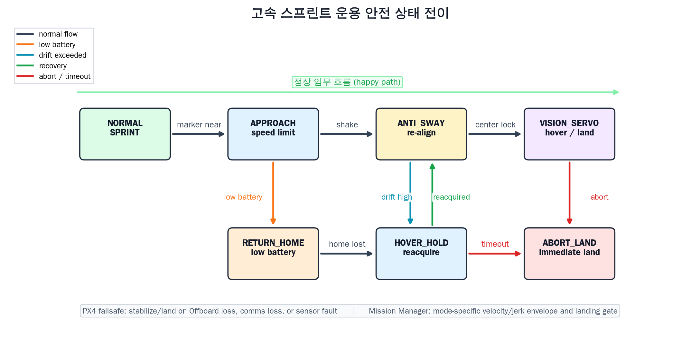

**Fig. 10.** 고속 스프린트 전략에서 적용하는 안전 상태 전이. 마커 접근, 흔들림, drift 과다, 저전압, abort, 착륙 gate 조건에 따라 감속/재정렬/귀환/착륙 상태로 전환한다.

## 4-3. 안전장치의 시뮬레이션 또는 실제 작동

### 시뮬레이션 시험 환경

- Gazebo Harmonic 기반 경기장 월드
- PX4 SITL `gz_x500_mono_cam_down` 모델
- Micro XRCE-DDS Agent를 통한 PX4-ROS2 연동
- 하향 카메라, IMU, 기압계, 자력계, air data 토픽 확인
- ROS2 launch: `sim_px4_full.launch.py`

### 현재 확인된 시뮬레이션 작동

제출 초안 작성 시점 기준으로, 팀이 구축한 기존 Gazebo 경기장 월드, 카메라 rig, ROS-GZ bridge, 인식/계획/미션/제어 launch 스택을 실행하여 49.253초 분량의 rosbag 데이터를 기록했다. 실행 로그에서 mission manager의 `INIT` 상태와 미션 시작 서비스 응답을 확인했고, rosbag에는 `INIT -> TAKEOFF -> HOME_INIT -> GRID_SEARCH` 상태 전이가 기록되었다. 제어기는 `TAKEOFF -> SPRINT` 모드로 전환되었으며, 기록된 주요 데이터는 위치 추정 1,223개, trajectory setpoint 985개, local position 1,231개, 하향 카메라 프레임 13개, grid/marker 메시지 각 13개이다. 기록 구간의 최대 위치 샘플 간 점프는 0.120m였다.

또한 PX4 SITL smoke check에서는 Micro XRCE-DDS Agent와 PX4 Gazebo 모델 연동, 하향 카메라 토픽, 자세/센서 토픽, `/mission/start` 호출 후 Offboard/armed 상태 진입이 확인되었다. 즉, 4-3의 안전장치 검증은 계획만 있는 상태가 아니라, 최소한의 통합 실행과 Offboard 진입 확인까지 완료된 상태다.


**Fig. 7.** 기존 Gazebo/ROS2 통합 스택 실행 중 기록한 rosbag 기반 검증 결과. 위치, setpoint, local position, 카메라/인식 관련 토픽이 함께 기록되었고, 미션 상태 전이가 정상적으로 발생했음을 보여준다.

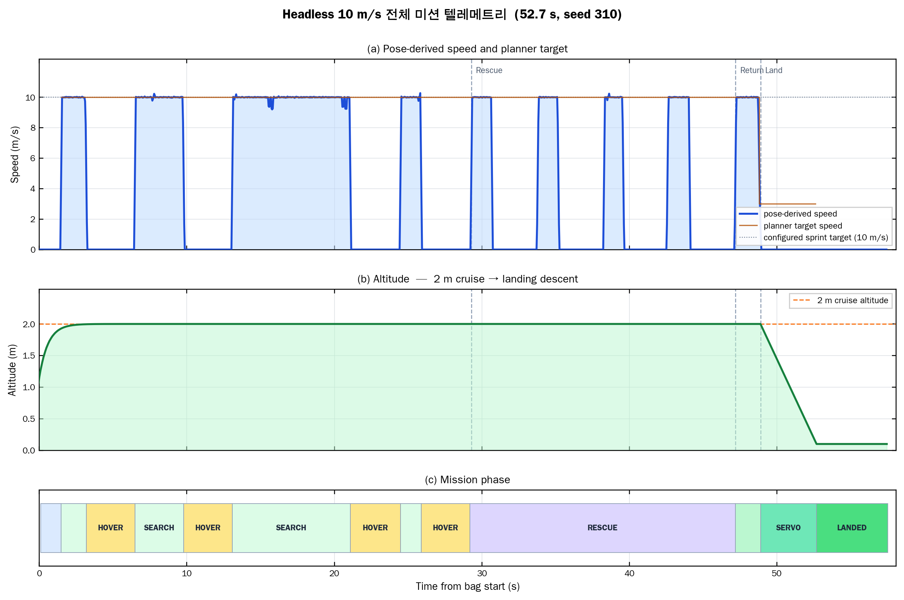

**Fig. 8.** 기존 Gazebo/ROS2 통합 스택 실행 중 기록한 명령 속도, 고도, 미션/제어 상태 전이. 향후 동일한 방식으로 속도 제한, 저전압 귀환, drift 과다 대응, 착륙 gate를 반복 검증한다.

### 안전장치 시험 현황 및 계획

| 시험 항목 | 상태 | 방법 | 성공 기준 |
|-----------|------|------|-----------|
| Gazebo 월드 + ROS2 통합 실행 | 완료 | 기존 경기장 월드, 이동 카메라 rig, ROS2 launch 스택 실행 후 rosbag 기록 | 미션 상태 전이 및 trajectory setpoint 기록 |
| PX4 SITL Offboard 진입 | 완료 | PX4 SITL, Micro XRCE-DDS Agent, `/mission/start` smoke check | armed=true 및 Offboard enabled 확인 |
| Offboard 유지 | 진행 예정 | 20Hz setpoint 송신 중단/재개 | failsafe 동작 또는 안전 모드 진입 |
| 저전압 귀환 | 진행 예정 | Mission Manager에 low battery 입력 | 즉시 RETURN 상태 전환 |
| 속도 제한 | 부분 완료 | SPRINT/TAKEOFF 모드 전환 및 setpoint 기록 | 모드별 속도 clamp 적용 |
| drift 과다 | 진행 예정 | 위치 추정 오차 주입 | 감속 및 교차점 재획득 |
| 마커 재검출 실패 | 진행 예정 | 구조 좌표 주변 ArUco 제거/가림 | 소형 탐색 패턴 진입 |
| 착륙 gate | 진행 예정 | 중심 오차/속도 조건 조작 | 조건 미충족 시 하강 금지 |

---

# 부록. 그림 구성 계획

아래 그림들은 본문 흐름에 맞춰 삽입 완료했다. Fig. 5/6은 현재 Gazebo 마커 배치와 `mission_path_real` 계열 경로 스타일을 반영했고, Fig. 7/8은 기존 Gazebo 월드와 ROS2 통합 launch 스택을 실행해 기록한 rosbag 데이터를 기반으로 작성했다. Fig. 11/12는 동일한 54개 교차점 후보를 사용한 랜덤 ArUco 배치 mission-cost sweep 결과다.

| 그림 번호 | 삽입 위치 | 제목 | 목적 | 제작 방법/출처 |
|-----------|-----------|------|------|----------------|
| Fig. 1 | 1-1 시스템 개요 | 전체 시스템 블록도 | 기체보다 소프트웨어 계층이 핵심임을 한눈에 설명 | 생성 완료: `fig_01_system_block.png` |
| Fig. 2 | 1-1 비행 단계 | Phase 0~3 미션 흐름도 | 탐색/구조 전략 분리를 강조 | 생성 완료: `fig_02_mission_flow.png` |
| Fig. 3 | 2-1 항법 시스템 | Optical Flow + 교차점 스냅 원리 | GPS 비의존 위치 추정의 핵심 기술 설명 | 생성 완료: `fig_03_optical_flow_snap.png` |
| Fig. 4 | 2-1 소프트웨어 구조 | ROS2 C++ 노드 아키텍처 | 자체 개발 소프트웨어 범위 제시 | 생성 완료: `fig_04_software_architecture.png` |
| Fig. 5 | 2-2 Phase 1 탐색 | 교차점-to-교차점 S자 탐색 경로 | 라인 PID 없이 격자선 근처를 통과하는 전략 설명 | 생성 완료: 현재 마커 배치 기반 경로 figure |
| Fig. 6 | 2-2 Phase 2 구조 | 전체 미션 경로 및 구조 방문 순서 | 탐색/호버/구조/귀환 단계 분리와 시간 단축 전략 강조 | 생성 완료: `mission_path_real` 계열 경로 figure |
| Fig. 7 | 4-3 시뮬레이션 작동 | Gazebo/ROS2 rosbag 검증 결과 | 실제 실행 데이터와 상태 전이 제시 | 생성 완료: 기존 Gazebo 실행 데이터 |
| Fig. 8 | 4-3 시뮬레이션 작동 | Gazebo 실행 텔레메트리 | setpoint, 고도, 상태 전이를 수치화 | 생성 완료: 기존 Gazebo 실행 데이터 |
| Fig. 9 | 3-1 창의성 | 일반 라인 트레이싱 vs 본 전략 비교 | 전략 차별성 강조 | 생성 완료: `fig_09_strategy_comparison.png` |
| Fig. 10 | 4 안전장치 | 안전 상태 전이도 | 고속 전략의 안전성을 설명 | 생성 완료: `fig_10_safety_state_machine.png` |
| Fig. 11 | 2-4 지상 및 비행 시험 계획 | ArUco 랜덤 배치 sweep 결과 | 뭉친/분산 배치에 대한 전략 민감도 제시 | 생성 완료: `fig_11_marker_sweep_results.png`, `marker_layout_sweep.csv` |
| Fig. 12 | 2-4 지상 및 비행 시험 계획 | 대표 ArUco 배치별 탐색/구조 경로 | 랜덤 배치 조건에서도 Phase 1/2 전환 구조 설명 | 생성 완료: `fig_12_marker_layout_cases.png` |
| Fig. 13 | 2-2 예상 임무 시간 | Phase 1 속도-시간 trade-off | 5/6/7m/s 탐색 속도에 따른 시간 이득과 ArUco 노출 프레임 비교 | 생성 완료: `fig_13_phase1_speed_tradeoff.png`, `phase1_speed_sweep.csv` |

부록의 표는 제출 직전 figure 누락 여부를 확인하기 위한 체크리스트로 사용하고, 최종 제출본에서는 필요 시 이 부록 자체를 삭제한다.
